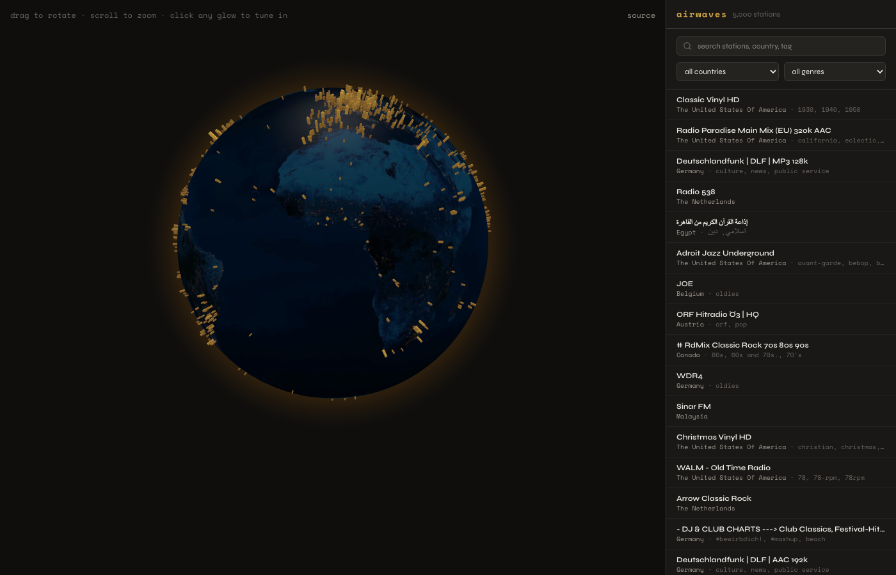

# airwaves

Browse and tune into about 5,000 live internet radio stations from a spinning 3D globe. Pick a country, pick a station, hit play. Powered by the volunteer-run [Radio Browser](https://www.radio-browser.info/) directory and `globe.gl` / Three.js.



## What it does

- **3D globe** with a station marker for every entry in Radio Browser that has geo coordinates. Marker brightness scales with the station's lifetime click count, so popular stations stand out.
- **Tune in instantly**. Click any marker (or any row in the sidebar) and the player starts streaming. Internet radio streams are mostly MP3 or AAC, which the browser's built-in `<audio>` element handles natively.
- **Search and filter**. Free-text search across station name, country, and tag. Two dropdowns for country and genre derived from what's actually in the loaded data.
- **Auto-rotate until you grab it**. The globe spins lazily on first load and stops the moment you start dragging or scrolling.
- **No backend.** Everything runs in the browser; the only server work is the static Next.js build itself.

## Why I built it

Radio Garden does something similar but is closed source and runs on its own opaque data. I wanted to see if I could put together a credible alternative in a weekend using only public APIs and a single Vercel deployment. About a thousand lines of TypeScript later, the answer is yes.

It's also a nice excuse to play with `globe.gl`, the small layer over Three.js that powers a lot of "data on a 3D earth" visualizations. Highly recommended if you have geo data and want it to feel tangible.

## How it works

1. On first load, the page hits `https://de1.api.radio-browser.info/json/stations/search?has_geo_info=true&hidebroken=true&order=clickcount` and pulls the top 5,000 stations by click count. The result gets cached in `localStorage` for 24 hours so subsequent visits are instant.
2. The first 2,500 stations are projected onto the globe as small spherical markers, deduplicated by `(lat, lng)`. Marker size and color are a log-scaled function of click count.
3. Clicking a marker selects the station and starts playback; the globe pans to center on it.
4. The audio player is a plain `<audio>` element. Some streams set CORS headers, some don't, some are HTTP-only and get blocked by browsers on HTTPS pages. The player surfaces those errors as a one-line message instead of pretending it's still loading.
5. Every successful play notifies Radio Browser via their click-counter endpoint so they can rank stations based on real usage. The library is volunteer-run; this is the polite thing to do.

## Caveats

- **Not every station works.** The directory has plenty of dead URLs that haven't been pruned yet. The `hidebroken=true` filter helps but some streams still 404. When that happens the player shows an error; click another one.
- **Browser HTTPS rules.** A page served over HTTPS won't play HTTP-only streams. Some otherwise-fine stations end up unplayable for that reason. Nothing the app can do; that's a security boundary.
- **No "now playing" metadata.** Radio Browser doesn't expose track info; you'd need to read each station's individual ICY metadata header, which most stations strip or block via CORS. On the future-ideas list.

## Stack

- Next.js 16 (App Router, static)
- React 19
- Tailwind CSS v4
- `react-globe.gl` / `three` for the 3D scene
- `lucide-react` for icons

## Run locally

```bash
git clone https://github.com/c-tonneslan/airwaves
cd airwaves
npm install
npm run dev
# open http://localhost:3000
```

The first load fetches a few MB of station JSON from Radio Browser. After that it's all cached.

## Credits

All the actual radio stations come from [Radio Browser](https://www.radio-browser.info/), a free, community-maintained directory of internet radio stations. Big thanks to the volunteers who keep it running. If this app is useful, consider [donating to them](https://www.radio-browser.info/users/donate) or contributing data fixes upstream.

The night-side Earth texture is the standard `three-globe` example asset hosted via unpkg.

MIT. Built by [Charlie Tonneslan](https://c-tonneslan-portfolio.vercel.app/).
